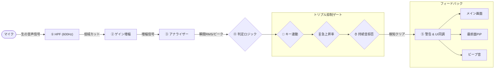

# KeyNoise Guard (キーボード打鍵騒音 リアルタイム検知システム)

KeyNoise Guardは、マイク入力からキーボードの打鍵音（特にタイピング時の「強打」や騒音）をリアルタイムに検知・可視化し、快適なタイピング環境と周囲への配慮をサポートするWebアプリケーションです。

---

## 🔗 公開URL
[**https://noise-detector-ruby.vercel.app/**](https://noise-detector-ruby.vercel.app/)

*※マイクによってはノイズ抑制機能が自動で働く場合があります。マイク側のノイズキャンセリング設定を軽減した状態でお使いください。*

---

## 🚀 使い方 (画面+主要操作3ステップ)

ブラウザ上で以下の3ステップを実行するだけで、即座にタイピング騒音の監視を開始できます。

1. **マイク監視の開始**
   - 画面上の「**監視開始**」ボタンをクリックし、ブラウザのマイク使用許可を与えます。
2. **ノイズ環境の測定（キャリブレーション）**
   - 部屋を静かにした状態で「**静寂測定（3秒）**」をクリックします。現在の部屋の環境騒音（エアコン等の雑音）のベースラインが測定され、検知しきい値が自動調整されます。
3. **感度調整と誤検知フィルターの選択**
   - キーを叩いてみて、しきい値ゲージを越えて「強打検知」するか試します。
   - 反応しづらい場合は「**マイク入力ゲイン**」スライダーを上げて調整します。
   - 話し声等で誤検知する場合は、「**キー連動モード**」（キーを押した直後だけマイクをONにする機能）や「**ノイズゲート**」をONにして誤判定をカットします。

### 📺 画面拡張・その他の機能
- **PiP（ピクチャーインピクチャー）表示:** 「📺 PiP表示」をクリックすると、別作業中（Excelやゲーム等）でも画面の隅に常に最前面表示されるミニメーター窓が起動し、同期して警告をフラッシュ表示します。
- **🌓 テーマ切替:** ライトテーマとダークテーマを1タップで切り替え可能です（設定はブラウザに永続保存されます）。

---

## 💻 ローカルでの動かし方

本システムは外部サーバーやデータベースを一切使用しない「完全スタンドアロン構成」です。

1. 本リポジトリをご自身のPCにクローンまたはダウンロードします。
2. フォルダ内にある `index.html` ファイルをダブルクリックし、Webブラウザ（Google Chrome や Edge 推奨）で開くだけで即座に起動します。

---

## 🛠️ 使用技術・AI活用

### 1. 使用技術
- **フロントエンド:** HTML5 / CSS3（バニラCSS / 変数によるライト・ダークテーマ切替設計）
- **音声処理・API:** Web Audio API（`BiquadFilterNode` の600Hzハイパスフィルター, `AnalyserNode` による波形取得, `OscillatorNode` での合成音アラート）
- **ブラウザAPI:** Document Picture-in-Picture API（最前面フローティング窓への波形・警告の毎フレーム同期描画）
- **ライブラリ:** なし（ロード時間・描画オーバーヘッド最小化のため完全バニラ実装）

### 2. AI（Gemini）の活用実績
本システムの開発にあたり、以下の設計・実装においてAIと協調（ペアプログラミング）しました。
- **音響処理・ノイズ抑制アルゴリズムの共同設計:** 話し声と打鍵音を切り分けるための「ハイパスフィルタ」「音量急上昇率（Rise-rate）」「持続信号判定」を組み合わせたトリプルノイズ抑制ゲートロジックの構築。
- **数学的判定モデルの実装:** 打鍵音の周波数特徴をベクトル化して学習し、コサイン類似度で照合する処理コードの自動生成。
- **最新APIの実装スピード向上:** ドキュメントの少ない `Document Picture-in-Picture API` の複雑な同期描画ボイラープレートのコード化。
- **セキュリティ・静的監査:** コード内へのシークレット情報の有無、キーロギング等のスパイウェア的挙動の排除の検証、および本README内 Mermaid フローチャートの構築。

#### 📊 システム構成・処理フロー図

---

## 🔒 セキュリティとプライバシーについて
- **音声のローカル処理:** マイクから取得した音声はメモリ上でのリアルタイム解析のみに使用され、外部送信やファイル保存は一切行われません。
- **キーロギングの完全排除:** キー連動機能では「キーが押された瞬間」のイベントのみを使用し、入力された特定のキーの文字情報の記録や取得は一切行いません。
