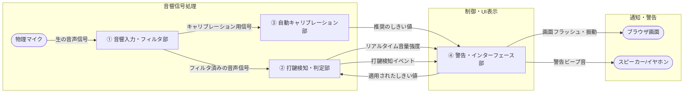

# システムコンポーネント分解とデータフロー設計

騒音検知ツールを4つの抽象的なコンポーネントに分解し、それぞれの役割、入力、出力を定義します。

## 1. コンポーネント定義表

| コンポーネント名 | 役割 | 入力 | 出力 |
| :--- | :--- | :--- | :--- |
| **① 音響入力・フィルタ部** | マイクから生音を取得し、エアコン音や会話（話し声）などの不要な低周波成分をカットし、キーボード打鍵特有の「カチッ」とした高周波クリック音のみを抽出する。 | ・マイクからの生音信号 | ・不要な周波数を減衰させた音声信号 |
| **② 打鍵検知・判定部** | フィルタ済みの信号を監視し、音量が瞬間的に急上昇する特徴（アタック音）を捉え、設定された「しきい値」と比較して、基準値を超える強い打鍵を判定・検出する。 | ・フィルタ済みの音声信号 ・検知のしきい値設定 | ・打鍵検知イベント ・リアルタイムの音量強度データ |
| **③ 自動キャリブレーション部** | 静かな状態で周囲の定常的な雑音（ノイズフロア）を数秒間測定し、その部屋の環境に合わせた最適な「基準しきい値」を自動で計算する。 | ・測定期間中の音声信号 | ・自動算出された推奨のしきい値 |
| **④ 警告・インターフェース部** | システムの開始/停止を行い、音波をグラフ化し、打鍵検知時にユーザー設定（画面フラッシュ/警告音）に従ってリアルタイムに警告を出す。 | ・打鍵検知イベント ・リアルタイムの音量強度データ ・推奨のしきい値 ・ユーザーの操作（開始/停止、警告ON/OFF設定） | ・画面表示（波形、ステータス、ログ、点滅・振動エフェクト） ・警告の物理音（スピーカー出力） |

---

## 2. データの流れ（データフロー）

### ① 音声データの入力と絞り込み
【物理マイク】から生の音が **「① 音響入力・フィルタ部」** へ渡ります。
ここで声や空調音などの雑音を取り除いた「フィルタ済みの音声信号」を作り、 **「② 打鍵検知・判定部」** へ渡します。

### ② 静寂レベルの測定（キャリブレーション時）
調整時、 **「① 音響入力・フィルタ部」** からの音声データが **「③ 自動キャリブレーション部」** に一時的に渡ります。
測定後に算出された「推奨のしきい値」が **「④ 警告・インターフェース部」** を通じて **「② 打鍵検知・判定部」** へ設定として送られます。

### ③ 打鍵の検知と警告の発生
常時監視中、 **「② 打鍵検知・判定部」** はフィルタ済み音声信号としきい値を比較し、強打を検知すると「打鍵検知イベント」を **「④ 警告・インターフェース部」** へ送ります。同時に、画面描画用の「リアルタイムの音量強度データ」も送り続けます。
**「④ 警告・インターフェース部」** は、あらかじめ画面で設定された内容（画面表示・警告音のON/OFF）に基づいて、ブラウザの画面を赤く光らせて揺らしたり、スピーカーから警告音を鳴らしたりします。

---

## 3. システム構成図（データフロー関係図）

